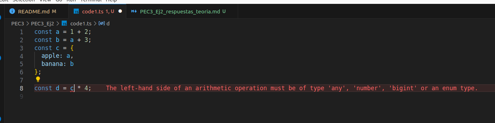

# Code1

## Explicación del error:
El error se produce porque estamos intentando realizar una operación inválida en JavaScript, que es la multiplicación de un objeto (`c`) por un número (`4`). Los objetos en JavaScript no pueden ser multiplicados directamente. Esto provoca que se dispare un TypeError en tiempo de ejecución.

## Ventajas:
Detectar este tipo de errores en tiempo de desarrollo, como lo hace TypeScript, ayuda a:

- **Evitar errores en tiempo de ejecución**: Al detectar el error antes de ejecutar el código, se previene que el programa falle cuando se está utilizando, lo que mejora la experiencia del usuario y la estabilidad del software.
  
- **Facilitar la depuración**: Al recibir notificaciones de errores en tiempo de desarrollo, es más fácil identificar y corregir los problemas antes de que se conviertan en errores críticos en producción.
  
- **Mejorar la calidad del código**: Al corregir los errores en tiempo de desarrollo, se garantiza que el código entregado es de alta calidad y está libre de errores conocidos.

# Code2

1. `a`: TypeScript inferirá el tipo `number` para la variable `a` porque se asigna un valor numérico (1042). El tipo se infiere directamente del valor asignado.
2. `b`: TypeScript inferirá el tipo `string` para la variable `b` porque se asigna una cadena de caracteres ('apples and oranges'). Al igual que en el caso anterior, el tipo se infiere directamente del valor asignado.
3. `c`: TypeScript inferirá el tipo `string` para la variable `c` también, ya que se asigna una cadena de caracteres ('pineapples').
4. `d`: TypeScript inferirá el tipo `boolean[]` (array de booleanos) para la variable `d` debido a que se asigna un array de booleanos ([true, true, false]). TypeScript infiere el tipo de array basándose en los tipos de los elementos contenidos en él.
5. `e`: TypeScript inferirá el tipo `{ type: string }` para la variable `e`, ya que se asigna un objeto con una propiedad `type` de tipo string. TypeScript infiere el tipo de objeto basándose en los tipos de las propiedades.
6. `f`: TypeScript inferirá el tipo `(number | boolean)[]` (array de números o booleanos) para la variable `f` porque se asigna un array que contiene tanto números como booleanos ([1, false]). Al tener diferentes tipos en el array, TypeScript infiere un tipo unión que representa todos los posibles tipos de los elementos del array.
7. `g`: TypeScript inferirá el tipo `number[]` para la variable `g` porque se asigna un array de números ([3]).
8. `h`: TypeScript inferirá el tipo `null` para la variable `h` porque se asigna el valor `null`. En TypeScript, `null` es un tipo válido y puede ser inferido directamente del valor asignado.

TypeScript realiza la inferencia de tipos basándose en los valores asignados a las variables y utiliza reglas específicas para determinar los tipos de datos más adecuados.

# Code3

1. `i = 4;`:
   - **Error TS2588**: Este error se produce porque estamos tratando de asignar un nuevo valor a una constante (`i`) después de que ya se le haya asignado un valor en su declaración (`const i: 3 = 3;`). En TypeScript, las constantes no pueden ser reasignadas después de haber sido inicializadas.

2. `j.push('5');`:
   - **Error TS2345**: Este error ocurre porque estamos tratando de añadir un elemento de tipo `string` ('5') a un array `j` que TypeScript infirió como un array de números (`number[]`). El método `push` espera argumentos del tipo definido para el array, en este caso, números. Al intentar añadir una cadena de texto, se produce un error de tipo.

3. `let k: never = 4;`:
   - **Error TS2322**: El tipo `never` representa el tipo de valores que nunca pueden ocurrir. Este error se produce porque estamos intentando asignar un valor (`4`) al tipo `never`, lo cual es incompatible. El tipo `never` se utiliza comúnmente para funciones que nunca retornan o en casos donde se desea expresar que algo nunca sucederá.

4. `let l: unknown = 4;` y `let m = l * 2;`:
   - **Error TS2571**: El tipo `unknown` representa un valor que puede ser de cualquier tipo. En este caso, al asignar `4` a la variable `l`, TypeScript la infiere como tipo `unknown`. Luego, al intentar realizar una operación de multiplicación (`*`) con un valor de tipo `unknown`, TypeScript nos indica que no se puede realizar la operación sin una comprobación de tipo previa. Esto es para evitar operaciones no seguras con valores de tipo desconocido.

## Diferencia entre Clase e Interface en TypeScript

1. **Clases**:
   - Las clases en TypeScript son similares a las clases en lenguajes de programación orientados a objetos como Java o C#. Permiten definir tanto la estructura de un objeto (sus propiedades y métodos) como su comportamiento.
   - Las clases pueden contener propiedades, métodos, constructores y pueden extender otras clases para heredar su funcionalidad.
   - Las clases se utilizan para crear instancias de objetos concretos que pueden ser utilizados en tiempo de ejecución.
   - Permiten la implementación de conceptos como la herencia, el encapsulamiento y el polimorfismo.

2. **Interfaces**:
   - Las interfaces en TypeScript son contratos que definen la estructura de un objeto. Establecen qué propiedades y métodos debe tener un objeto para cumplir con la interfaz.
   - Las interfaces no pueden contener implementaciones de métodos ni inicializadores de propiedades. Simplemente declaran la forma que deben tener los objetos que las implementan.
   - Se utilizan principalmente para definir tipos de datos y establecer una relación entre diferentes partes del código.
   - Las interfaces pueden ser implementadas por clases, lo que garantiza que las clases que las implementan proporcionen todas las propiedades y métodos definidos en la interfaz.
   - Las interfaces son útiles para establecer contratos entre componentes de un sistema y facilitan la interoperabilidad y el trabajo en equipo.

En conclusión, las clases se utilizan para definir objetos concretos con comportamiento y estado, mientras que las interfaces se utilizan para definir tipos de datos y establecer contratos entre componentes del sistema. Las clases se utilizan cuando se necesita implementar comportamiento y encapsulamiento, mientras que las interfaces se utilizan para definir tipos abstractos y establecer relaciones entre partes del código.
